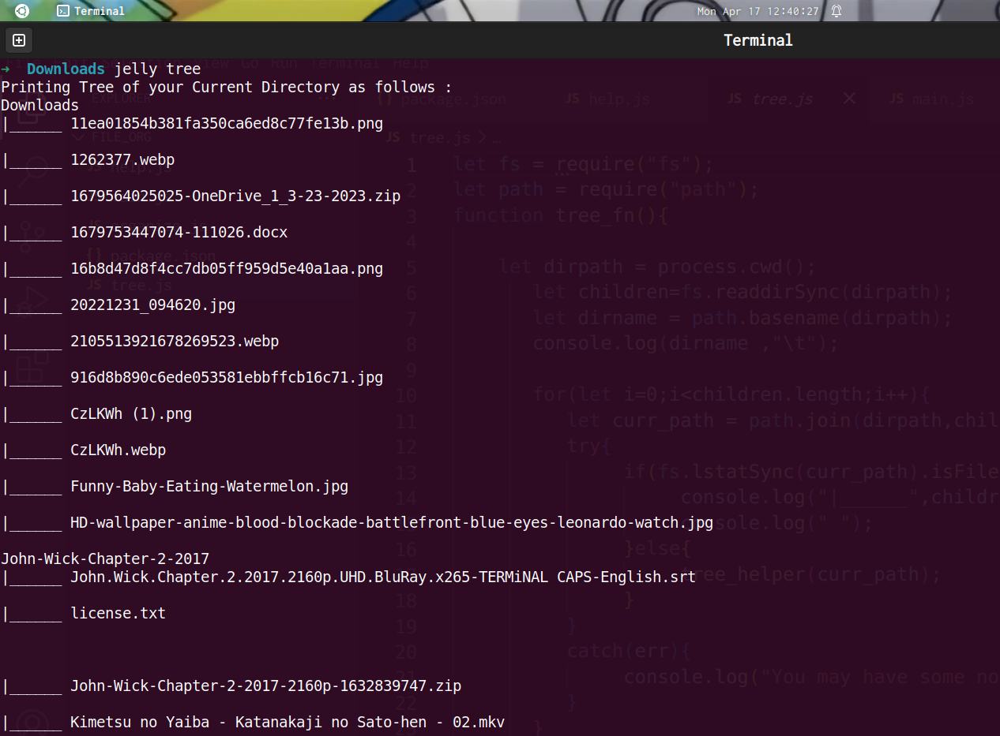

# JELLY : A File System Organiser
<!-- PROJECT LOGO -->
  
<!-- ABOUT  -->
## About
Jelly is a file system organiser which organises and manages the files , folder according to their extensions and show details of all files and folder inside your current directory.
This project is fully based on javaScript and Modules of Node js , in this project ,modules such as Path Module and File System Module  of Nodejs is used and  Jelly listen following three commands : 

### Jelly Tree
this command gives the details of all folders and their respective files inside of your current directory by making a rooted tree 
for this we are using file system module of nodejs and depth first algorithm for traversing depth of current directory 

### SCREENSHOTS
 

### Jelly Organize
this command organised your local files according to their extensions , it first cut the file from its path and paste into a different folder named MANAGER FILE according to extension of file
for example  xyz.pdf file goes to DOC folder of #### Manager File  Folder

### Jelly help
this command gives help guide 
